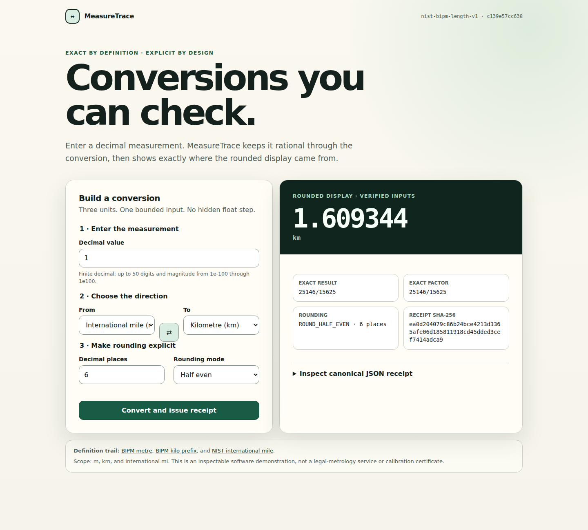

# MeasureTrace

MeasureTrace converts metres, kilometres, and international miles without a binary floating-point step. Every result exposes its exact rational factor, explicit decimal rounding, and a canonical JSON receipt that a deliberately independent verifier recomputes.

The scope is intentionally narrow: three length units, one bounded decimal grammar, one inspectable trust path.

## Try it

Python 3.12.11 is the pinned runtime. There are no third-party runtime dependencies.

```console
python -m measuretrace convert 1 mi km --places 6
# 1 mi -> 1.609344 km
# exact: 25146/15625
# factor: 25146/15625
# rounding: ROUND_HALF_EVEN at 6 decimal places
# receipt-sha256: <digest>

python -m measuretrace convert 1 mi km --places 6 --receipt receipt.json
python -m measuretrace verify receipt.json
python -m measuretrace serve --host 127.0.0.1 --port 8000
```

Open `http://127.0.0.1:8000/` for the server-rendered interface. It uses standard-library WSGI, local CSS, no JavaScript, no cookies, and no runtime network dependency.

## Exactness contract

The registry stores metres per unit as reduced rational numbers:

| Symbol | Definition used |
| --- | ---: |
| `m` | `1/1 m` |
| `km` | `1000/1 m` |
| `mi` | `201168/125 m` = `1609.344 m` exactly |

Definitions are anchored to primary standards sources:

- [BIPM: SI base unit metre](https://www.bipm.org/en/si-base-units/metre)
- [BIPM: SI prefixes](https://www.bipm.org/en/measurement-units/si-prefixes), where kilo is `10^3`
- [NIST: revised unit conversion factors](https://www.nist.gov/pml/us-surveyfoot/revised-unit-conversion-factors), where the international/statute mile is `1609.344 m` exactly
- [NIST SP 811 Appendix B.8](https://www.nist.gov/pml/special-publication-811/nist-guide-si-appendix-b-conversion-factors/nist-guide-si-appendix-b8), an independent NIST table of the same mile factors

Decimal inputs are bounded to 80 characters, 50 mantissa digits, and adjusted exponents from -100 through 100. Results remain `Fraction` values until the selected rounding rule is applied. Supported rules are half-even, half-up, and toward zero, at 0–12 decimal places.

The receipt schema is documented in [docs/receipt-v1.schema.json](docs/receipt-v1.schema.json). `measuretrace.verifier` intentionally does not import the conversion core or registry module; it owns a small duplicated trust root and recomputes the input, factor, exact result, rounded result, registry digest, and receipt digest.

## Architecture

```text
Web UI ─┐
        ├─> bounded Decimal input ─> exact Fraction conversion ─> receipt builder
CLI ────┘                         ▲                              │
                                  │                              ▼
                      NIST/BIPM registry ─────────────> independent verifier
```

See [docs/architecture.md](docs/architecture.md) for boundaries and data flow, and [docs/threat-model.md](docs/threat-model.md) for abuse cases, controls, deployment assumptions, and residual risks.

## Verification

```console
python -m pip install --require-hashes -r requirements-dev.lock
python tools/quality_gate.py
python -m unittest discover -s tests -v
python -m compileall -q -f measuretrace tests tools
```

CI uses Python 3.12.11, a hash-locked universal `flit_core` wheel, and GitHub Actions pinned to full commit SHAs. Its repository token has read-only contents permission and checkout credentials are not persisted. Wheel and source archive are each built twice under a fixed `SOURCE_DATE_EPOCH`; byte digests must match before a clean-environment wheel smoke test runs.

## Evidence, not mockups

The evidence job starts this exact WSGI application on loopback, captures real Chrome renders at 390, 768, and 1440 CSS-pixel widths with tall viewports for the complete flow, executes the real CLI and verifier, derives architecture/workflow diagrams from the implemented modules, and computes a legacy-approximation drift dataset through the exact core. A manifest records every byte, dimension, source commit, browser version, and SHA-256.

Generated media is uploaded as a workflow artifact first. It is not committed or described as repository evidence until a later review verifies the manifest, image structure, visible output, and provenance. See [docs/evidence.md](docs/evidence.md).

### Reviewed portfolio evidence

[](evidence/portfolio/ui-1440x1300.png)

The adopted bytes were generated by [CI run 31288049557](https://github.com/omar07ibrahim/units1/actions/runs/31288049557) for source commit [`e9c2d941`](https://github.com/omar07ibrahim/units1/commit/e9c2d941b7a7e931329655d6ff7621801230f639), then checked through a separate stream-based audit before this later commit added them.

- Responsive UI: [390 px](evidence/portfolio/ui-390x2300.png), [768 px](evidence/portfolio/ui-768x1700.png), and [1440 px](evidence/portfolio/ui-1440x1300.png)
- Executed behavior: [CLI transcript](evidence/portfolio/cli-transcript.png) and [animated result tour](evidence/portfolio/result-tour.gif)
- Trace model: [architecture](evidence/portfolio/architecture.svg) and [conversion flow](evidence/portfolio/conversion-flow.svg)
- Regression evidence: [legacy drift chart](evidence/portfolio/legacy-drift.svg) and [source CSV](evidence/portfolio/drift.csv)
- Integrity and provenance: [manifest](evidence/portfolio/manifest.json) and [review record](evidence/portfolio/README.md)

## Legacy baseline

The original application is preserved byte-for-byte under `legacy/source/`, anchored by Git blob IDs and the original main commit in `legacy/baseline.json`. Regression tests reproduce its observed conversion behavior and keep the original defects explicit. Frozen legacy code is excluded from the wheel and production execution.

## Non-goals and rights status

MeasureTrace is not a calibration service, legal-metrology system, broad unit library, localization framework, benchmark, or claim of numerical superiority over established libraries. It does not sign receipts or establish who produced one; SHA-256 only makes post-issuance byte changes detectable.

No repository license has been selected in this branch. Reuse rights must not be inferred. The branch makes no ownership or authorship claim. Details are in [docs/provenance.md](docs/provenance.md).
